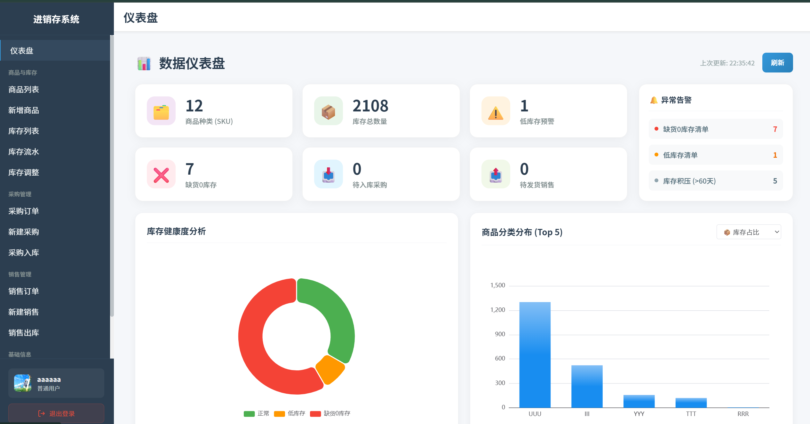
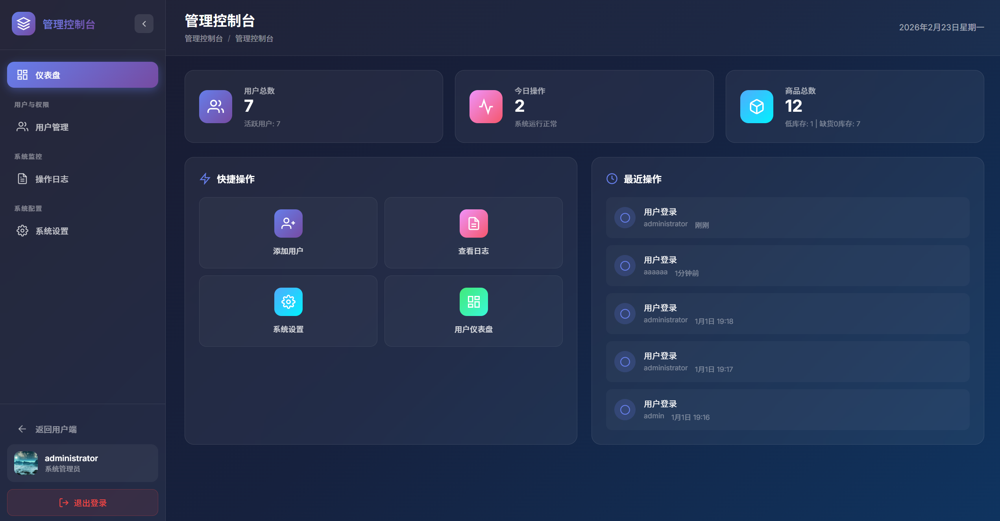

<div align="center">

# 📦 智能进销存管理系统 (AI嵌入版)

**基于 Spring Boot 3 + Vue 3 + LangChain4j 构建的全栈式、智能化分布式进销存管理系统**

</div>

<p align="center">
  <!-- Frontend Tech -->
  <a href="https://vuejs.org/"></a>
  <a href="https://vite.dev/"></a>
  <a href="https://developer.mozilla.org/en-US/docs/Web/JavaScript"></a>
  <a href="https://pinia.vuejs.org/"></a>
  <br>
  <!-- Backend & AI -->
  <a href="https://www.oracle.com/java/technologies/downloads/#java17"></a>
  <a href="https://spring.io/projects/spring-boot"></a>
  <a href="https://mybatis.org/mybatis-3/"></a>
  <a href="https://www.mysql.com/"></a>
  <a href="https://redis.io/"></a>
  <a href="https://fastapi.tiangolo.com/"></a>
  <a href="https://python.langchain.com/"></a>
  <a href="LICENSE"></a>
</p>

---

## 项目简介 (Overview)

**Inventory Management System with Embedded AI** 是一套专为中小微企业定制的现代化、智能化进销存与仓储管理系统（ERP）。系统聚焦于核心业务流：采购入库、销售出库、库存流转，以及后台系统数据管控，协助企业告别传统手工台账，提升供应链协同效率并降低运营成本。

在系统的最新架构升级中，我们引入了**微服务架构**，将原有的 Java 单体 AI 模块拆分为独立的 **Python FastAPI 智能微服务 (AiService)**。通过结合 **LangChain** 框架与 **Redis Stack 向量搜索引擎**，我们打造了具备全局业务感知能力的 **AI 智能仓储助手**。Nginx 作为 API 网关无缝路由前端的 AI 问答流，而独立的 Python 节点专职处理自然语言语义搜索、向量映射和速率限制 (RPM/TPM/RPD)，实现极其灵活且高性能的人机协同现代化管理。

---

## 系统主页 (Screenshots)

<div align="center">


<br><br>


</div>

---

## 架构设计与系统概览 (Architecture)

### AI 嵌入与核心架构六大支柱

| 核心组件           | 技术实现                       | 功能描述                                                                        |
| :----------------- | :----------------------------- | :------------------------------------------------------------------------------ |
| **独立 AI 微服务** | **Python + FastAPI**           | 剥离 AI 算力，独立的 Python 微服务节点专职提供流式大语言模型推理及速率控制。    |
| **智能对话服务**   | **SSE (Server-Sent Events)**   | 提供类似 ChatGPT 的流式打字机问答面板，并在 Redis 中进行高速 Token 记忆与限流。 |
| **RAG 语义搜索**   | **LangChain + Redis Stack**    | 支持用大白话模糊搜索商品（例如输入“数码产品”，智能找出手机、电脑等商品）。      |
| **智能工具调用**   | **Function Calling (`@tool`)** | AI 智能体跨语言 Callback 内部 Java 安全端点，获取实时库存和统计数据。           |
| **异步向量同步**   | **Spring AOP + HTTP Call**     | 当商品发生增删改时，Java 后端会自动通过 HTTP 异步通知 Python 微服务刷新向量。   |
| **API 统一网关**   | **Nginx 反向代理**             | 将前端请求透明地分流：`/api/ai` 路由到 Python，`/api` 其他接口路由到 Java。     |
| **多端跨平台支持** | **Electron + Capacitor**       | 使用同一套网页前端代码，可以同时打包并运行在浏览器、电脑软件和手机 App 上。     |
| **基础进销存业务** | **Spring Boot 3 + ECharts**    | 包含常规的采购、销售和库存管理，并用图表展示业务报表，支持扫码记账。            |

---

## 📂 项目目录导航 (Directory Structure)

```text
.
├── Frontend/                        # Vue 3 前端跨平台主工程
│   ├── src/                         # 业务源码目录
│   │   ├── api/                     # Axios 请求接口封装 (包含 AI 问答接口)
│   │   ├── assets/                  # 静态资源 (公共样式与图标)
│   │   ├── components/              # 封装业务组件 (含 AiAssistant.vue 悬浮打字机面板)
│   │   ├── router/                  # Vue Router 路由管理与登录鉴权守卫
│   │   ├── stores/                  # Pinia 状态管理中心 (用户登录态、缓存)
│   │   ├── views/                   # 全量业务页面结构 (看板、商品管理、单据录入等)
│   │   └── App.vue                  # 根组件 (定义主体布局与 AI 挂载)
│   ├── electron/                    # Electron 桌面端主进程脚本及配置
│   ├── android/                     # Capacitor 适配生成的原生安卓工程
│   ├── vite.config.js               # Vite 核心配置 (端口转发与打包策略)
│   └── package.json                 # 前端工程配置与自动化脚本
├── AiService/                       # Python FastAPI AI 微服务工程
│   ├── agent.py                     # LangChain 智能体与 Sentence-Transformers 检索逻辑
│   ├── main.py                      # FastAPI 主入口点与异常全局拦截器
│   ├── rate_limiter.py              # Redis RPM/TPM/RPD 频控限流策略
│   ├── router.py                    # API 路由与 Server-Sent Events 流式生成器
│   ├── tools.py                     # AI 函数调用回调工具 (对接 Java 端点)
│   └── requirements.txt             # Python 依赖清单
├── Backend/                         # Java Spring Boot 核心业务工程
│   ├── src/main/java/               # 业务源码目录
│   │   └── com/example/backend/
│   │       ├── aspect/              # AOP 切面 (ProductEmbeddingAspect 触发向量同步)
│   │       ├── controller/          # 业务控制器及 InternalAiToolController (供 Python 回调)
│   │       ├── mapper/              # MyBatis Mapper 接口定义
│   │       ├── model/               # 实体类、DTO、VO 等数据模型
│   │       └── service/             # 业务服务层 (商品、订单、统计核心逻辑)
│   ├── src/main/resources/          # 配置文件与静态资源
│   │   ├── application.properties   # 核心配置 (MySQL、Redis 及 Python 节点地址)
│   │   ├── schema.sql               # 数据库初始化结构脚本
│   │   └── data.sql                 # 演示环境基础数据脚本
│   └── pom.xml                      # 后端 Maven 依赖配置文件
├── docker-compose.yml               # 集成微服务架构一键编排 (Nginx, Java, Python, Redis)
├── Dockerfile                       # 多阶段镜像打包构建文件 (含环境托管与运行)
├── nginx.conf                       # Nginx 网关配置 (路由 /api/ai 到 Python，其余到 Java)
├── .env.example                     # 部署环境隔离变量模板 (需拷贝为 .env)
└── README.md                        # 项目技术文档与开发手册
```

---

## 🛠️ 技术栈清单 (Tech Stack)

### 核心技术栈与微服务

- **Java 业务服务**: Spring Boot 3.3.2
- **Python AI 服务**: FastAPI 0.115 + Uvicorn
- **AI 智能体框架**: LangChain (Python) + LangChain OpenAI
- **向量数据库**: Redis Stack (内置 RediSearch 模块，用于高维向量检索)
- **向量嵌入模型**: Sentence-Transformers (All-MiniLM-L6-v2 384维本地模型)
- **持久层框架**: MyBatis Starter 3.0.5 + MySQL 8.0
- **核心工具**: ZXing 3.5.2 (条形码处理), Spring AOP + `@Async` (异步向量同步)
- **基础缓存**: Spring Boot Starter Data Redis

### 前端核心技术

- **核心框架**: Vue 3.5.22 (Composition API)
- **构建工具**: Vite 7.1.11
- **状态管理**: Pinia 3.0.3
- **数据可视化**: ECharts 6.0.0
- **桌面容器**: Electron 39.2.7
- **移动容器**: Capacitor 8.0.0 (面向 Android)
- **代码质量**: ESLint 9.x + Oxlint + Prettier

---

## 🚀 快速开始与本地开发 (Getting Started)

### 1. 前置环境要求

- **Java 开发包**: JDK 17
- **前端运行环境**: Node.js v20.19.0+ 或 v22.12.0+
- **构建管理工具**: Maven 3.8+ (或使用自带的 `./mvnw` / `mvnw.cmd`)
- **容器与数据库**: Docker & Docker Compose
- **大模型 API Key**: 兼容 OpenAI 协议的 API（如 OpenAI、Gemini、硅基流动等）
- **数据库**: MySQL 8.0+

### 2. 运行前端工程

#### 启动 Web 开发服务器

```bash
cd Frontend
npm install
npm run dev
```

访问 Web 页面：[http://localhost:5173](http://localhost:5173)

#### 启动 Electron 桌面开发版

```bash
npm run electron:dev
```

### 3. 启动微服务群

#### 启动 Java 核心业务服务

进入后端工程目录并执行：

```bash
cd Backend
./mvnw.cmd spring-boot:run
```

Java 服务将运行于 **http://localhost:8080**。

### 4. 启动 Python AI 微服务

打开新终端，进入 AI 服务目录，创建虚拟环境并安装依赖后启动：

```bash
cd AiService
python -m venv venv
# Windows 激活虚拟环境:
.\venv\Scripts\activate
# Linux/macOS 使用: source venv/bin/activate
pip install -r requirements.txt
uvicorn main:app --host 0.0.0.0 --port 8000 --reload
```

Python 服务将运行于 **http://localhost:8000**。

_(注：前端开发环境已在 `vite.config.js` 中配置了多端反向代理，开发阶段无需强制配置本地 Nginx 即可正常进行请求转发与跨域处理)_

---

## 生产部署方案 (Deployment)

### Docker Compose 一键容器化部署

项目原生提供了一键容器化编排服务。我们将自动拉起 Nginx 前端、Spring Boot 后端、以及独立的 `Redis Stack Server` 向量数据库镜像。

#### 1. 准备环境变量

在项目工程根目录处拷贝示例环境变量文件，以创建你的私有环境配置文件：

```bash
cp .env.example .env
```

用编辑器打开 `.env` 文件，完善你的 MySQL 连接参数、Redis 的访问秘匙，**以及核心大模型的连接端点**：

```ini
# MySQL 数据库配置 (需预先建表，宿主机 Host 设为 host.docker.internal)
MYSQL_HOST=host.docker.internal
MYSQL_PORT=3306
MYSQL_DATABASE=your_database_name
MYSQL_USERNAME=your_username
MYSQL_PASSWORD=your_password

# 大模型 API 连接信息 (将注入到 Docker 后端容器中)
AI_BASE_URL=https://api.openai.com/v1
AI_API_KEY=your_api_key
AI_MODEL_NAME=gpt

# 域名配置
DOMAIN_NAME=localhost
```

#### 2. 一键集成编译及构建

在确认当前宿主机已经启动了 Docker Engine 或 Docker Desktop 的前提下，运行：

```bash
docker-compose up -d --build
```

---

## 📄 开源许可证 (License)

本项目采用 [AGPL-3.0](LICENSE) 许可证发布。

Copyright © 2026-Present [**yeflyleaf**](https://github.com/yeflyleaf). 保留所有权利。

---

<div align="center">

_驱动中小微企业数字化生态重构，若本项目对你的学习、二次开发、业务开展有帮助，欢迎给我们一颗小小的 Star 等作为对开源作者的支持和鼓励！_

</div>
